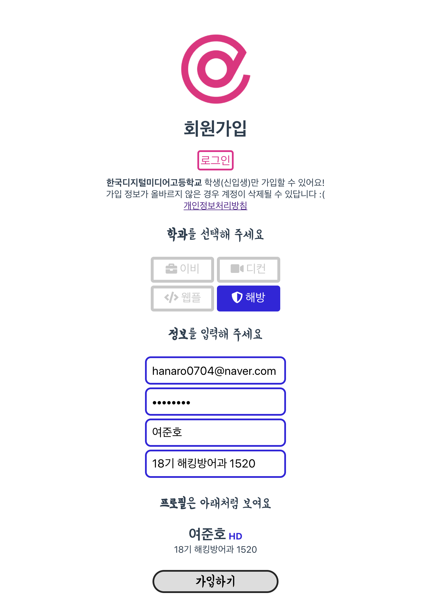
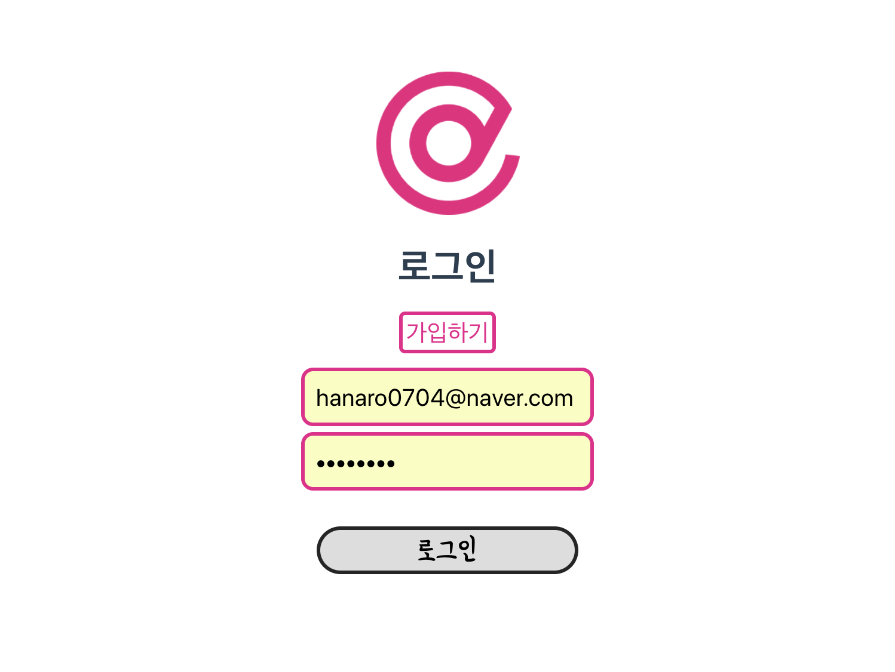
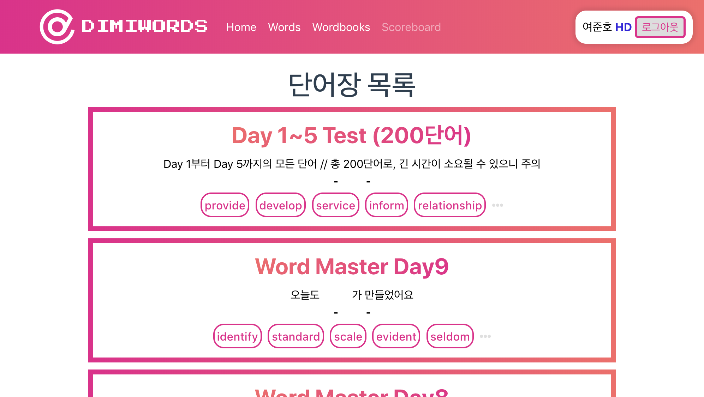
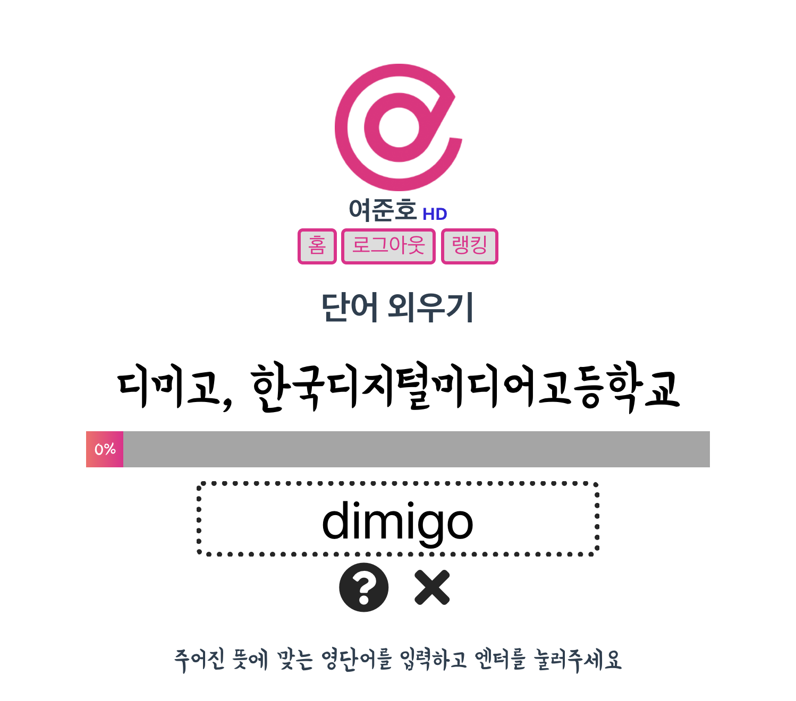
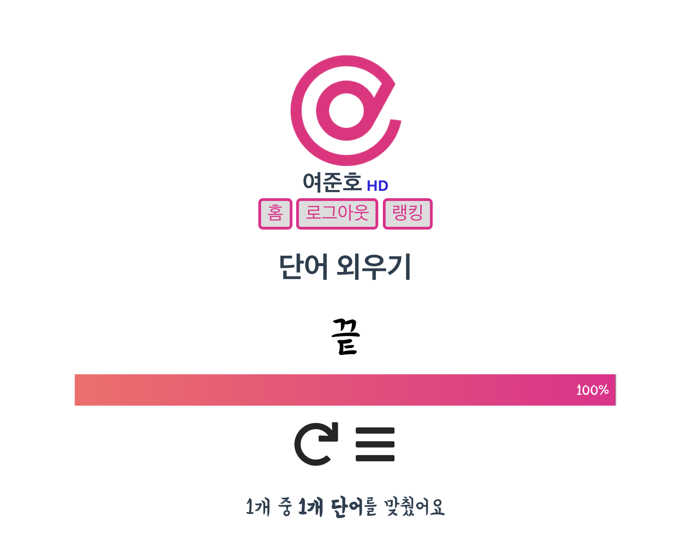

# Dimiwords [](https://standardjs.com)
18기 디미고 신입생을 위한 단어장 서비스 API 및 웹 애플리케이션입니다.

# Screenshots

## 회원 가입 및 로그인


## 단어장 목록 및 랭킹


## 단어 테스트


# Run

```bash
cd Server
npm install
sudo forever start ./bin/www
cd ../Web
npm install
npm run-script build
sudo forever start serve.js
```

## Lint 

```bash
cd Server
standard --fix
cd ../Web
eslint --fix --ext .js,.vue src
```
